<p align="center">
  
</p>

<h1 align="center">Stratoseer</h1>
<p align="center"><strong>Your AI board of advisors, scanning ahead.</strong></p>
<p align="center">
  A multi-agent career intelligence system that scouts job openings, certifications, courses, events, communities, and industry trends, then synthesizes them into strategic recommendations, risk assessments, and tailored cover letters.
</p>

---

## What does it do?

You define a career profile (your skills, targets, constraints, and CV). Stratoseer dispatches a network of specialized AI agents that:

1. **Scout** the web for opportunities matching your profile
2. **Format and rank** everything it finds with evidence-backed claims
3. **Analyze strategically** via CEO and CFO advisor agents
4. **Generate cover letters** tailored to specific job postings using your CV
5. **Audit every step** so you can trace exactly how each result was produced

Everything is governed by policy-as-code (YAML files) that control which agents can access what tools, how many tokens they can spend, and what data crosses agent boundaries.

---

## See it in action

### Dashboard

The dashboard gives you a bird's-eye view: your profiles, recent runs, and quick stats.

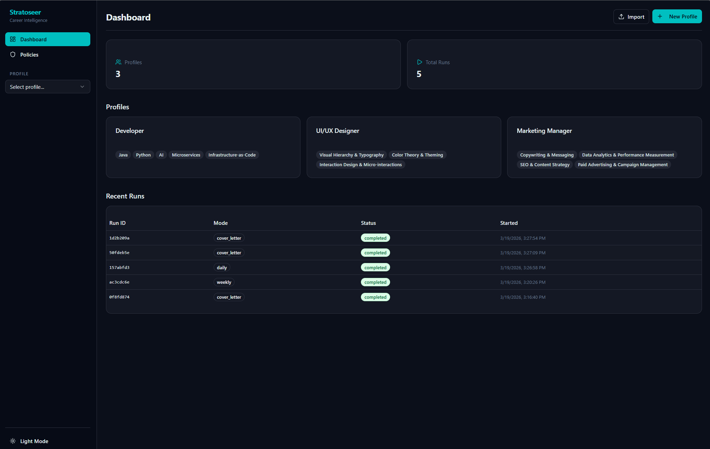

Each profile is an independent workspace. A Developer, a UI/UX Designer, and a Marketing Manager can all coexist, each with their own runs, results, and cover letters.

---

### Profile setup

Create a profile with your name, targets, constraints, skills, and CV. Skills can be imported directly from an uploaded CV.

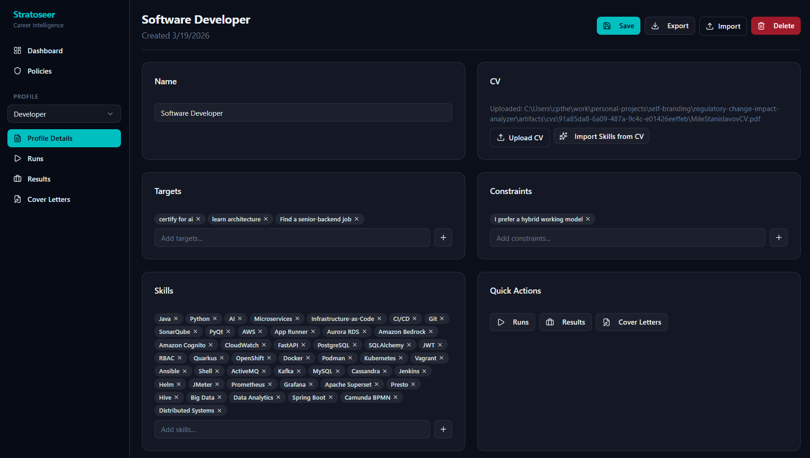

The profile feeds every pipeline. Targets like "certify for AI" or "find a senior-backend job" drive what the scouts search for. Constraints like "hybrid working model" filter what comes back.

---

### Running a pipeline

Trigger a daily, weekly, or cover letter run. Each run records a full audit trail showing every agent that fired, what it produced, and when.

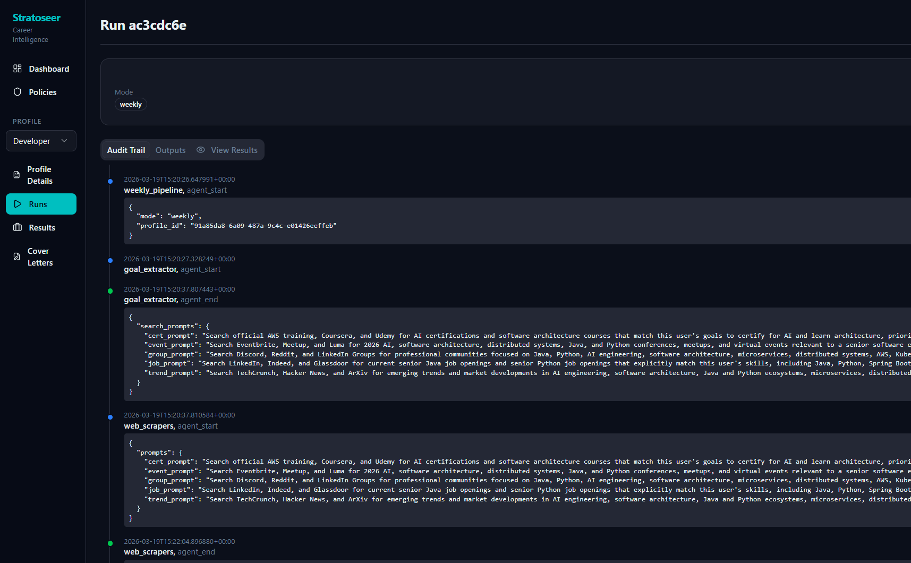

The audit trail is append-only. You can see the `goal_extractor` parse your profile into search prompts, the `web_scrapers` fan out across sources, and every intermediate result along the way.

---

### Results: Jobs

The scouts find real job postings that match your profile. Each result includes a relevance summary and a link to the original source.

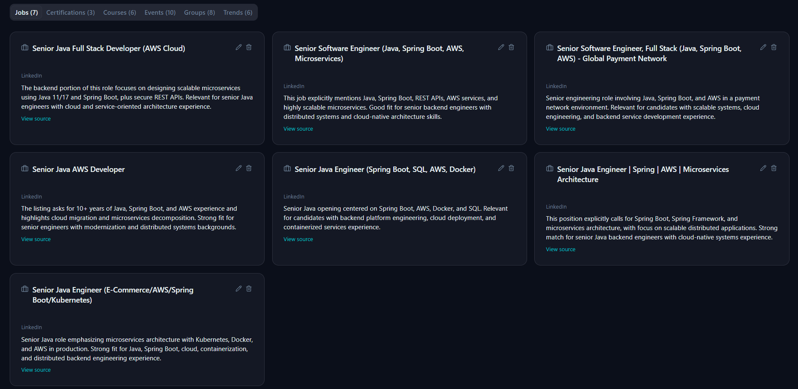

---

### Results: Courses

The same run also surfaces courses from platforms like Udemy and Coursera, matched to your skill gaps and career targets.

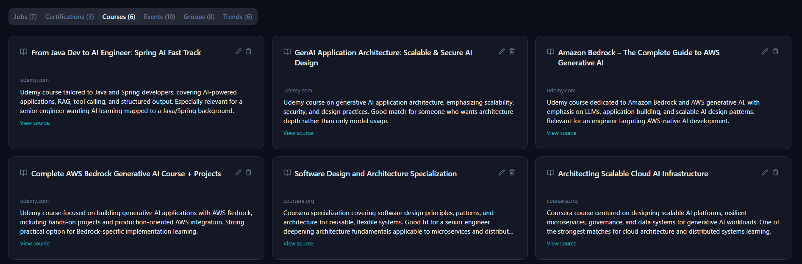

Results are organized into tabs: **Jobs**, **Certifications**, **Courses**, **Events**, **Groups**, and **Trends**.

---

### Weekly strategic analysis

A weekly run goes further. After gathering opportunities, the **CEO agent** produces strategic recommendations (prioritized by impact), and the **CFO agent** delivers a risk assessment with time estimates and ROI ratings.

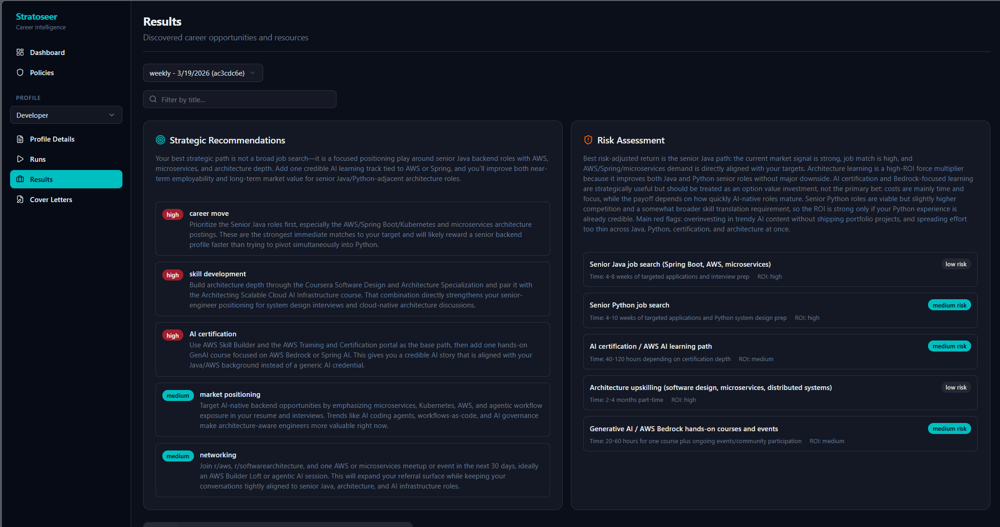

---

### Cover letters

Select a discovered job (or paste a raw job description) and generate a tailored cover letter. The agent reads your CV and the posting, then writes a letter grounded in your actual experience.


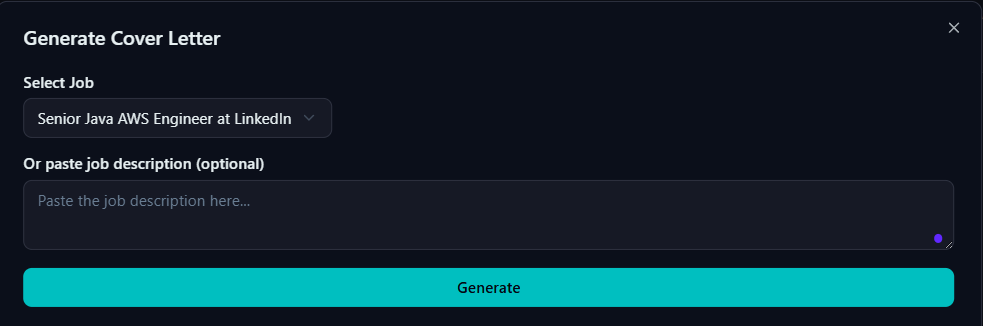

---

### Policies

All agent behavior is governed by read-only YAML policy files. Boundaries, budgets, redaction rules, allowed sources, and tool permissions are all inspectable from the GUI.

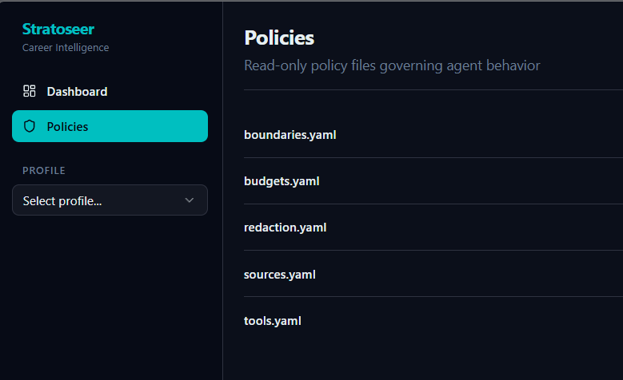

---

## Agent flow

Three pipelines, each a LangGraph `StateGraph`:

### Daily pipeline

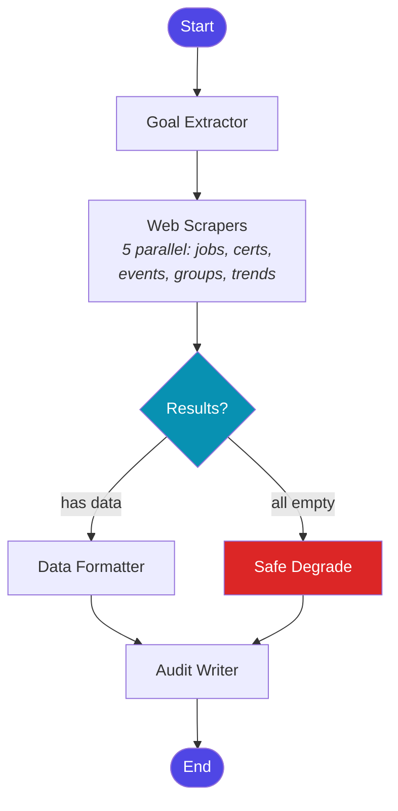

### Weekly pipeline

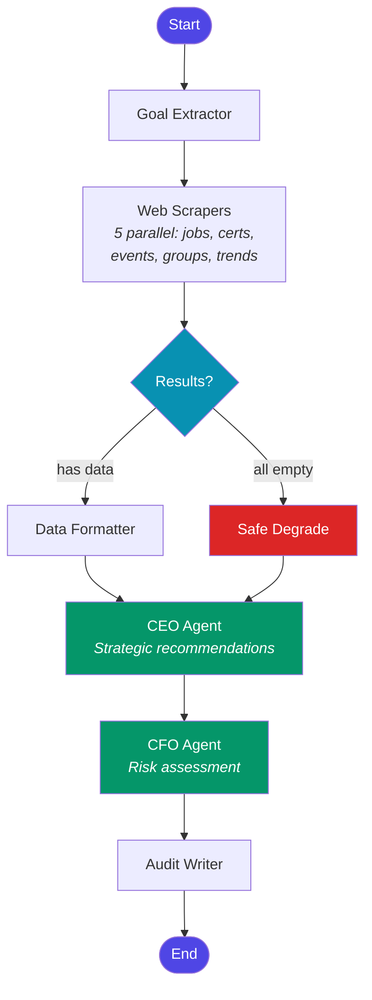

### Cover letter pipeline

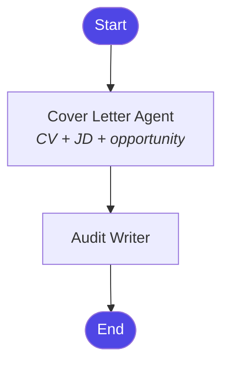

**Key design rules enforced by the policy engine:**

- **Scouts** (web scrapers) can access the network. Planners (CEO/CFO) cannot.
- **Safe degradation** activates when all scrapers return empty. The pipeline continues with an explicit partial status rather than failing silently.
- **Audit is terminal.** Every pipeline ends at the audit writer. No conditional exit paths.
- **CEO/CFO always run** in the weekly pipeline, even on empty data, so strategic analysis is always recorded.

---

## Local setup

### Prerequisites

- **Python** 3.11+
- **Node.js** 18+ (for the frontend build)
- **PostgreSQL** 16+ (via Docker or local install)
- **Docker & Docker Compose** (recommended for the database)

### 1. Clone the repository

```bash
git clone https://github.com/CodeMaster10000/stratoseer.git
cd stratoseer
```

### 2. Set up the backend

```bash
python -m venv .venv
source .venv/bin/activate        # Linux / macOS
# .venv\Scripts\activate         # Windows

pip install -e ".[dev]"
```

### 3. Configure environment

Create a `.env` file in the project root:

```env
POSTGRES_USER=assistant
POSTGRES_PASSWORD=assistant
POSTGRES_DB=assistant
POSTGRES_HOST=localhost
POSTGRES_PORT=5432
APP_HOST=0.0.0.0
APP_PORT=8000
APP_RELOAD=true
POLICY_DIR=policy
ARTIFACTS_DIR=artifacts
LOG_LEVEL=INFO

# Optional: enable real LLM calls (off by default, mock agents used)
# OPENAI_API_KEY=sk-...
# LLM_ENABLED=true
```

### 4. Start the database

```bash
docker compose up -d
```

### 5. Build the frontend

```bash
cd frontend
npm install
npm run build
cd ..
```

### 6. Run the server

```bash
uvicorn app.main:app --reload
```

Open [http://localhost:8000](http://localhost:8000) in your browser.

### 7. Run tests

```bash
pytest
```

Tests run against an in-memory SQLite database. No external services needed.

---

### Frontend development

If you want to work on the frontend with hot reload:

```bash
cd frontend
npm run dev
```

The Vite dev server runs on `http://localhost:5173` and proxies `/api` requests to the FastAPI backend on port 8000.

---

## Architecture decisions

### Policy-as-code, not convention

Agent behavior is governed by YAML policy files under `policy/`, not by informal coding patterns. The policy engine enforces tool allowlists, token budgets, data boundaries, and PII redaction at runtime. Adding a new agent or changing permissions is a YAML edit, not a code change.

### Deterministic verifier

The verifier is pure Python logic with zero LLM calls. It validates schema compliance, evidence coverage, confidence thresholds, deduplication, and output bounds. A failure is always explainable by reading the verifier report.

### Evidence-first contract

Every claim that references external information carries an `EvidenceItem` with a URL, SHA-256 content hash, and text snippet. Missing evidence causes a hard failure or explicit partial status. There are no silent gaps.

### Immutable audit trail

Every run produces an append-only JSONL log and a bundle JSON capturing input hashes, policy versions, prompt template IDs, tool call hashes, and the verifier report. This enables strict replay and drift detection.

### TypedDict for agents, Pydantic at boundaries

Inter-agent state within LangGraph uses `TypedDict` (idiomatic, lightweight). At API and persistence boundaries, data passes through Pydantic v2 models for validation and documentation.

### Safe degradation over silent failure

When all scrapers return empty, the pipeline explicitly marks the run as partial, logs the reason, and continues through the remaining agents. The audit trail always captures what happened and why.

### Async-first

All agents, the audit writer, and the replay/diff engines are async. Mock agents return before any `await`, so tests run fast. Real LLM-backed agents will benefit from non-blocking I/O without any plumbing changes.

### System overview

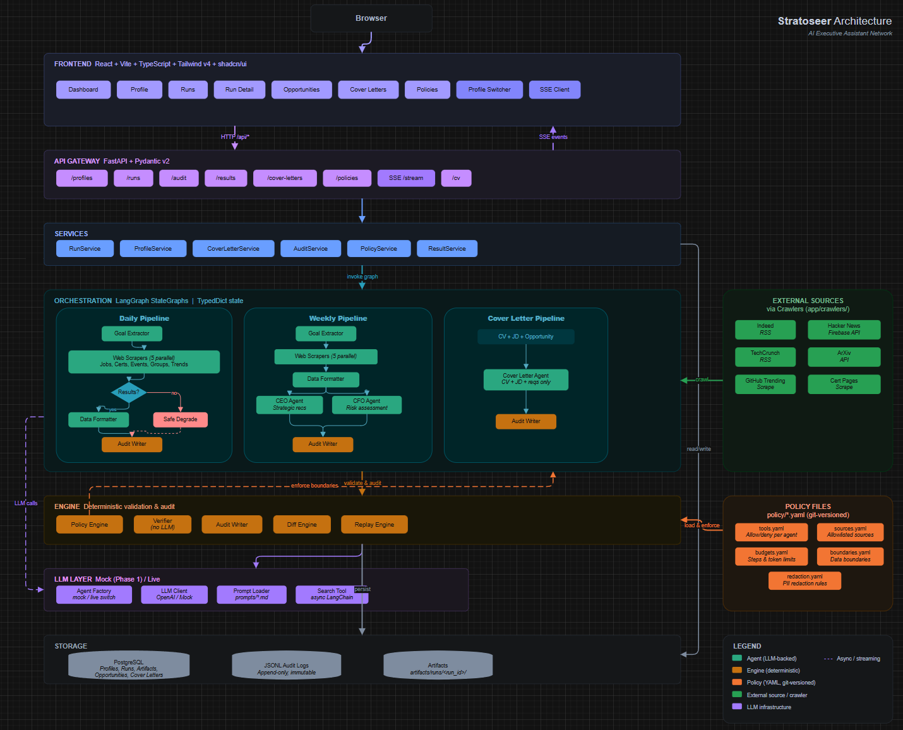

---

## Tech stack

| Layer | Technology |
|---|---|
| Orchestration | LangGraph (StateGraph) + LangChain |
| Backend | FastAPI + Pydantic v2 |
| Frontend | React + Vite + TypeScript + Tailwind CSS v4 + shadcn/ui |
| Database | PostgreSQL + append-only JSONL |
| Real-time | Server-Sent Events (SSE) |
| Policies | YAML under `policy/` |
| Testing | pytest + pytest-asyncio + in-memory SQLite |

---

## License

MIT
