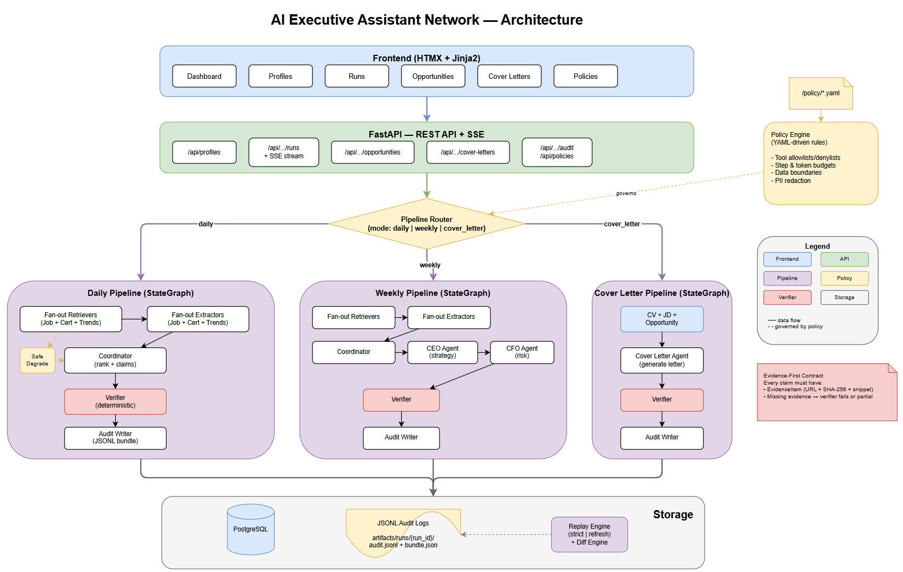

# AI Executive Assistant Network

## Introduction

This repository implements a **multi-agent AI system** designed to automate and structure the career intelligence workflow. It addresses a practical problem: professionals spend significant time manually scanning job boards, tracking certification changes, monitoring industry trends, and tailoring application materials - repetitive tasks that benefit from automation but demand accuracy and traceability.

The system deploys a network of specialized agents - retrieval scouts, strategic planners, a deterministic verifier, and an audit writer - coordinated through LangGraph state machines. Each agent has a narrowly scoped role, explicit tool permissions, and produces outputs that are independently verified before reaching the user. The result is a career intelligence pipeline that is auditable end-to-end, reproducible via replay, and extensible by adding new agents or policy rules without modifying the orchestration logic.

The application exposes both a REST API and a lightweight web GUI, supports multiple independent career profiles, and streams pipeline progress in real time. All agent behavior is governed by declarative YAML policies, and every execution produces an immutable audit bundle that enables strict reproducibility and drift detection.

---

A multi-agent career intelligence system that acts as a **digital board of advisors**. It orchestrates specialized AI agents - scouts, planners, a verifier, and an auditor - to continuously surface job opportunities, certification paths, and industry trends, then synthesize them into actionable career briefs and tailored cover letters.

Each agent operates under explicit **policy-as-code** constraints: tool allowlists, token budgets, data boundaries, and PII redaction rules - all defined in version-controlled YAML and enforced at runtime.

## Table of Contents

- [Requirements](#requirements)
- [Getting Started](#getting-started)
- [Architecture](#architecture)
- [How It Works](#how-it-works)
- [Critical Architectural Decisions](#critical-architectural-decisions)
- [API Reference](#api-reference)
- [Testing Strategy](#testing-strategy)
- [Agent & Model Evaluation](#agent--model-evaluation)
- [Packaging & CI](#packaging--ci)

## Requirements

- **Python** 3.13+
- **PostgreSQL** 16+ (provided via Docker Compose)
- **Docker** & **Docker Compose** (for the database)

## Getting Started

**1. Clone and set up the virtual environment**

```bash
git clone https://github.com/CodeMaster10000/ai-executive-assistant.git
cd ai-executive-assistant

python -m venv .venv
source .venv/bin/activate        # Linux/macOS
# .venv\Scripts\activate          # Windows

pip install -e ".[dev]"
```

**2. Configure environment**

```bash
cp .env.example .env
# Edit .env if you need to change database credentials, ports, etc.
```

**3. Start the database**

```bash
docker compose up -d
```

**4. Run the application**

```bash
python app/main.py
# Server starts at http://localhost:8000
```

**5. Run the tests**

```bash
pytest
```

## Architecture

The system is structured in four layers: a lightweight HTMX frontend, a FastAPI REST/SSE API, a LangGraph agent orchestration layer, and a dual-storage backend (PostgreSQL for entities, append-only JSONL for audit trails).



> Editable source: [`docs/architecture.drawio`](docs/architecture.drawio)

### Layer Breakdown

| Layer | Technology | Responsibility |
|-------|-----------|----------------|
| **Frontend** | HTMX + Jinja2 | Dashboard, profile management, run monitoring, opportunity browsing, cover letter viewer, policy inspector |
| **API** | FastAPI | REST endpoints, SSE streaming for real-time run progress, profile-scoped resource access |
| **Orchestration** | LangGraph StateGraph | Three pipeline definitions (daily, weekly, cover_letter), each a directed graph of agent nodes with conditional routing |
| **Storage** | PostgreSQL + JSONL | Relational entities (profiles, runs, opportunities, cover letters) + immutable, append-only audit logs per run |
| **Policy Engine** | YAML + Python | Enforces tool/source allowlists, step/token budgets, data boundaries, and PII redaction at runtime |

## How It Works

### Multi-Profile Workspaces

Every profile (e.g., "Cloud Architect", "Backend Developer") is an independent workspace. All runs, opportunities, and cover letters are scoped to a profile. The dashboard provides a profile switcher.

### Pipeline Execution

When a user triggers a run, the API creates a `Run` record and launches a LangGraph `StateGraph` in the background. There are three pipeline modes:

**Daily Pipeline** - Broad opportunity scan
```
Retrievers (Job + Cert + Trends) → Extractors → Coordinator → Verifier → Audit Writer
```
Fan-out retrieval across three scout types, structured extraction, ranking with evidence-backed claims, deterministic verification, and audit trail creation. If all retrievals return empty, the pipeline activates **safe degradation** - it continues with an explicit partial status rather than failing silently.

**Weekly Pipeline** - Strategic analysis
```
Retrievers → Extractors → Coordinator → CEO Agent → CFO Agent → Verifier → Audit Writer
```
Extends the daily pipeline with a CEO agent (strategic alignment, priority recommendations) and a CFO agent (risk assessment, resource analysis) before verification.

**Cover Letter Pipeline** - Targeted generation
```
CV + JD + Opportunity → Cover Letter Agent → Verifier → Audit Writer
```
Takes the user's CV content, a job description, and optionally a stored opportunity to produce a tailored cover letter with evidence-backed claims referencing both the CV and JD.

### Evidence-First Contract

Every claim that references external information must carry an `EvidenceItem` - a URL, SHA-256 content hash, and a text snippet. The verifier checks evidence coverage, confidence thresholds, schema compliance, deduplication, and output bounds. Missing evidence causes the verifier to fail the run or mark it as partial. There are no silent failures.

### Real-Time Progress

Each run streams progress events via Server-Sent Events (SSE). The frontend subscribes to `/api/profiles/{id}/runs/{id}/stream` and updates the UI as agents start, produce outputs, and complete.

### Replay & Diff

Completed runs can be replayed in two modes:
- **Strict** - re-executes using stored tool responses (zero network calls), verifying reproducibility
- **Refresh** - re-fetches URLs, compares content hashes against stored values, and flags drift

Both modes produce a diff report showing what changed: new/removed opportunities, evidence drift, priority shifts.

## Critical Architectural Decisions

### Policy-as-Code Over Convention

Agent behavior is governed by YAML policy files (`policy/*.yaml`), not by informal coding conventions. The policy engine enforces:

- **Tool allowlists/denylists** - Retriever agents can access the network; planner agents (CEO, CFO, Coordinator) cannot. The cover letter agent reads only CV + JD. These boundaries are checked at runtime, not trusted by convention.
- **Step and token budgets** - Each agent has a `max_steps` and `max_tokens` cap, preventing runaway execution.
- **Data boundaries** - Which fields can cross which agent boundaries is declared explicitly.
- **PII redaction** - Sensitive fields are redacted in audit logs according to configurable patterns.

This means adding a new agent or changing permissions is a YAML edit, not a code change - and policy unit tests verify that forbidden behavior is actually blocked.

### Deterministic Verifier (Not an LLM)

The verifier is pure Python logic - no LLM calls. It validates:
- JSON schema compliance of all agent outputs
- Evidence coverage (every claim with `requires_evidence=true` must have evidence IDs that resolve)
- Confidence thresholds (configurable minimum)
- Policy compliance (agent stayed within allowed tools/budgets)
- Deduplication (no duplicate opportunities)
- Output bounds (configurable max items)

This makes verification fast, reproducible, and auditable. A verifier failure is always explainable by looking at the report.

### Immutable Audit Trail

Every run produces an audit bundle under `artifacts/runs/{run_id}/`:
- `audit.jsonl` - append-only event log (agent starts, outputs, errors, with timestamps)
- `bundle.json` - input profile hash, policy version hash, prompt template IDs, tool call hashes, intermediate outputs, verifier report, and final artifacts

This enables strict replay: given the same inputs and stored responses, the system should produce the same outputs. Drift detection catches cases where it doesn't.

### TypedDict for Agents, Pydantic for Boundaries

Inter-agent state within a LangGraph pipeline uses `TypedDict` - idiomatic for LangGraph, lightweight, and avoids serialization overhead between nodes. At API and persistence boundaries, data passes through Pydantic v2 models for validation, serialization, and documentation.

### Safe Degradation Over Silent Failure

When retrieval yields nothing (network issues, empty sources), the pipeline does not silently return an empty result. It explicitly activates safe degradation: marks the run as partial, logs the reason, and continues through verification so the audit trail captures what happened and why.

### Mock-First, Swap Later

All Phase 1 agents return hardcoded fixture data. Each agent is a callable class with a `__call__(self, state) -> dict` interface. Swapping in real LLM calls means replacing the class body - the graph topology, verification, and audit infrastructure remain unchanged.

## API Reference

All endpoints use the `/api` prefix. Profile-scoped resources nest under `/api/profiles/{profile_id}`.

### Profiles

| Method | Endpoint | Description |
|--------|----------|-------------|
| `POST` | `/api/profiles` | Create a new career profile (name, targets, skills, CV) |
| `GET` | `/api/profiles` | List all profiles |
| `GET` | `/api/profiles/{id}` | Get a single profile |
| `PUT` | `/api/profiles/{id}` | Update profile details |
| `DELETE` | `/api/profiles/{id}` | Delete a profile and its associated data |
| `POST` | `/api/profiles/{id}/cv` | Upload a CV file for the profile |

### Runs

| Method | Endpoint | Description |
|--------|----------|-------------|
| `POST` | `/api/profiles/{id}/runs` | Start a new run (mode: `daily`, `weekly`, or `cover_letter`) |
| `GET` | `/api/profiles/{id}/runs` | List all runs for a profile |
| `GET` | `/api/profiles/{id}/runs/{run_id}` | Get run status and details |
| `GET` | `/api/profiles/{id}/runs/{run_id}/stream` | SSE stream of real-time progress events |
| `POST` | `/api/profiles/{id}/runs/{run_id}/cancel` | Cancel a running pipeline |

### Audit & Replay

| Method | Endpoint | Description |
|--------|----------|-------------|
| `GET` | `/api/profiles/{id}/runs/{run_id}/audit` | Retrieve the audit trail for a run |
| `GET` | `/api/profiles/{id}/runs/{run_id}/verifier-report` | Get the verifier's pass/fail report with per-claim details |
| `POST` | `/api/profiles/{id}/runs/{run_id}/replay` | Replay a run (mode: `strict` or `refresh`) |
| `GET` | `/api/profiles/{id}/runs/{run_id}/diff/{other_id}` | Compare two runs - surfaces changes in opportunities, evidence, and priorities |

### Opportunities & Cover Letters

| Method | Endpoint | Description |
|--------|----------|-------------|
| `GET` | `/api/profiles/{id}/opportunities` | List discovered opportunities across all runs |
| `GET` | `/api/profiles/{id}/opportunities/{opp_id}` | Get opportunity details with evidence references |
| `POST` | `/api/profiles/{id}/cover-letters` | Generate a cover letter (from an opportunity ID or raw JD text) |
| `GET` | `/api/profiles/{id}/cover-letters` | List all generated cover letters |
| `GET` | `/api/profiles/{id}/cover-letters/{letter_id}` | Get a cover letter with evidence references |

### Policies

| Method | Endpoint | Description |
|--------|----------|-------------|
| `GET` | `/api/policies` | List all active policy files |
| `GET` | `/api/policies/{name}` | Get the contents of a specific policy file |

## Testing Strategy

The project uses **pytest** with **pytest-asyncio** for async test support. Tests run against an **in-memory SQLite** database (via `aiosqlite`), eliminating external dependencies.

```bash
pytest                              # Run all tests
pytest tests/test_policy_engine.py  # Run a specific file
pytest -v                           # Verbose output
```

### Test Organization

| Test File | What It Covers |
|-----------|---------------|
| `test_policy_engine.py` | Policy loading, tool allowlist/denylist enforcement, budget checks, boundary rules, PII redaction |
| `test_verifier.py` | Schema validation, evidence coverage, confidence thresholds, dedup, output bounds, safe degradation |
| `test_audit_writer.py` | JSONL append, bundle creation, log reading, PII redaction in logs |
| `test_graphs_daily.py` | Full daily pipeline execution, opportunity counts, evidence creation, verifier pass, safe degradation path |
| `test_graphs_weekly.py` | Weekly pipeline with CEO/CFO agents, strategic recommendations, risk assessments |
| `test_graphs_cover_letter.py` | Cover letter pipeline, evidence-from-CV/JD, verifier pass, empty-CV edge case |
| `test_replay_diff.py` | Strict replay, refresh replay, diff report generation |
| `test_api_profiles.py` | Profile CRUD endpoints |
| `test_api_runs.py` | Run creation, listing, status transitions, SSE streaming |
| `test_api_cover_letters.py` | Cover letter creation, validation, listing |

### Testing Principles

- **Policy tests verify denial** - tests assert that forbidden tool usage is actually blocked, not just that allowed usage works.
- **Pipeline tests are end-to-end** - they compile and invoke the full `StateGraph`, not individual agents in isolation, catching integration issues in graph wiring.
- **The verifier is tested independently** - since it's deterministic, it gets thorough unit testing with edge cases (missing evidence, low confidence, duplicate items, empty inputs).
- **API tests use real FastAPI** - via `httpx.AsyncClient` with `ASGITransport`, testing the full request/response cycle including middleware and dependency injection.

## Agent & Model Evaluation

### Current State (Phase 1)

All agents are **mock implementations** returning hardcoded fixture data. This is intentional - it lets us build and validate the entire infrastructure (graph topology, verification, audit trails, replay, API, and GUI) without LLM cost or latency.

### Evaluation Strategy for Real Agents

When swapping in real LLM-backed agents, evaluation follows three layers:

**1. Output Schema Compliance** - The verifier already validates that every agent output matches the expected schema. This catches malformed JSON, missing fields, and type mismatches without any additional tooling.

**2. Evidence Fidelity** - For retriever/extractor agents, the verifier checks that every claim has evidence with valid URLs and content hashes. The refresh-mode replay re-fetches URLs and flags content drift, detecting hallucinated or stale references.

**3. Replay Regression** - Strict replay re-runs the pipeline with stored tool responses. If the output changes, the diff report shows exactly what diverged. This catches prompt regressions: a prompt template change that silently degrades output quality will surface as a diff against the previous run.

### Evaluation Workflow

```
1. Run pipeline with real agents → produces artifacts + audit bundle
2. Human review of output quality (briefs, cover letters)
3. Store the run as a "golden" baseline
4. After any prompt/model change, strict-replay the golden run
5. Diff report shows regressions → fix or accept
```

The audit bundle captures prompt template IDs and parameter hashes, so you can trace exactly which prompt version produced which output.

## Packaging & CI

### Current Packaging

The app is packaged as a standard Python project via `pyproject.toml` with `setuptools`. The database runs in Docker Compose.

```bash
pip install -e ".[dev]"     # Editable install with dev dependencies
docker compose up -d        # PostgreSQL
python app/main.py          # Start the server
```

### Docker Packaging (Planned)

A production `Dockerfile` will:
- Use a multi-stage build (builder + slim runtime image)
- Install only production dependencies (no `[dev]`)
- Run uvicorn with `--workers` for multi-process serving
- Set `APP_RELOAD=false` for production

### CI Pipeline (Planned)

The planned CI workflow (GitHub Actions):

```yaml
# Triggers: push to main, pull requests
steps:
  - Lint:        ruff check .
  - Type check:  (optional, mypy or pyright)
  - Test:        pytest --tb=short -q
  - Build:       docker build .
  - Push:        push image to registry (on main only)
```

**Why this order matters:**
- Lint catches style issues in seconds (fast feedback)
- Tests run against in-memory SQLite (no Docker-in-Docker needed for CI)
- Docker build only runs if tests pass (no wasted build minutes)
- Image push only happens on main (not on PRs)

### Environment Configuration

All configuration is driven by environment variables via a single `.env` file, shared between Docker Compose (database) and the application (via `pydantic-settings`):

| Variable | Default | Description |
|----------|---------|-------------|
| `POSTGRES_USER` | `assistant` | Database user |
| `POSTGRES_PASSWORD` | `assistant` | Database password |
| `POSTGRES_DB` | `assistant` | Database name |
| `POSTGRES_HOST` | `localhost` | Database host |
| `POSTGRES_PORT` | `5432` | Database port |
| `APP_HOST` | `0.0.0.0` | Server bind address |
| `APP_PORT` | `8000` | Server port |
| `APP_RELOAD` | `true` | Hot reload (disable in production) |
| `POLICY_DIR` | `policy` | Path to policy YAML files |
| `ARTIFACTS_DIR` | `artifacts` | Path to audit artifact storage |
| `LOG_LEVEL` | `INFO` | Logging level |
| `DB_ECHO` | `false` | Echo SQL statements (debug) |
